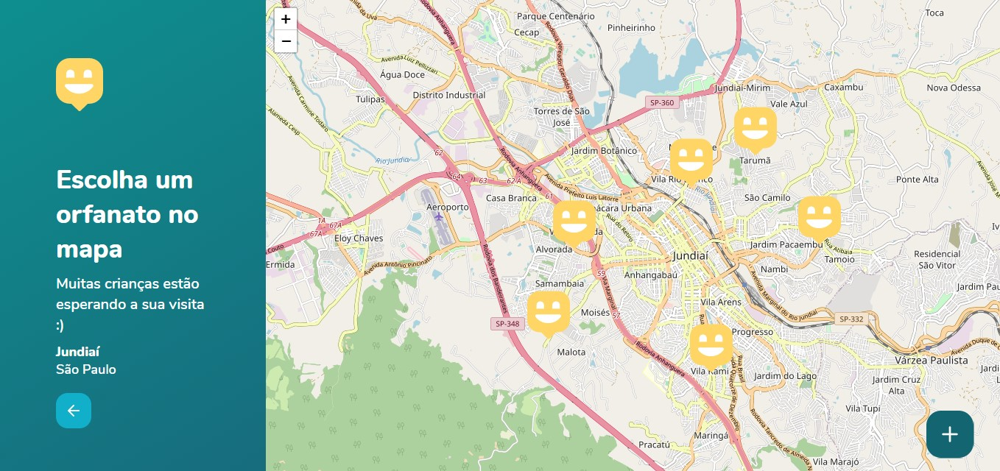
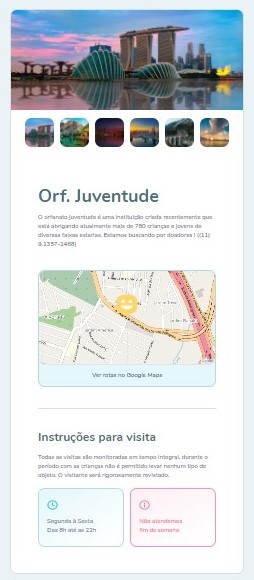
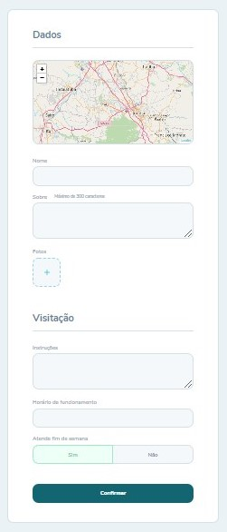

# Happy 😃
<h4 align="center">
  <strong>An application that connect people with orphanages.</strong>
</h4>

<p align="center">
    
</p>
<p align="center">
    
</p>

## About 📚
This is an app developed on Next Level Week 3 (event created by [Rocketseat 🚀](https://rocketseat.com.br/)).
In this application people register orphanages, with the information from the same ... and the best thing is that the orphanages have their position on a map, in which the user can navigate, and by clicking on it, the user has access to the information of the orphanage.
This application was developed to celebrate children's day, thinking of those who live in orphanages and are happy with a simple visit.

<div class="row">
  <p>
    
  </p>
  <p>
    
  </p>
</div>

***To build this app, we use:***
<div class="row">
  
  
  
  
  
</div>

## Building 🛠

### Layout ✒
WEB 🌐 [LAYOUT WEB](https://nodejs.org) <br>
MOBILE 📱 [LAYOUT MOBILE](https://nodejs.org)

You'll need [Node.js](https://nodejs.org) and  [Yarn](https://classic.yarnpkg.com/en/docs/install/#windows-stable) installed on your computer in order to build this app.
This is the front-end of the Happy app, to use all the functionalities, you will need to clone the [Happy-API](https://github.com/gabriellopes00/Happy-API). Because the database, server, images.... are in this API. Happy-API is running on
``` http://localhost:3333 ```
And the front-end is running on
``` http://localhost:3000 ``` <br>

#### Clone

```bash
    git clone https://github.com/gabriellopes00/Happy.git
```
#### Web Front-end 🌐

```ssh
cd web
yarn install
yarn start
```

## Possible Upgrades 🔧
[] Strengthen application validations
[] Improve the design and animations
[] Create a user system
[] Update Orphanages Information function
[] Create contact via WhatApp or Email

## Contact 📱

[](https://github.com/gabriellopes00)
[](https://www.linkedin.com/in/gabriel-lopes-6625631b0/)
[](https://twitter.com/_gabrielllopes_)
[](mailto:gabrielluislopes00@gmail.com)
  <a href="https://www.facebook.com/profile.php?id=100034920821684">
      
  </a> 
  <a href="https://www.instagram.com/_.gabriellopes/?hl=pt-br">
    
  </a>
